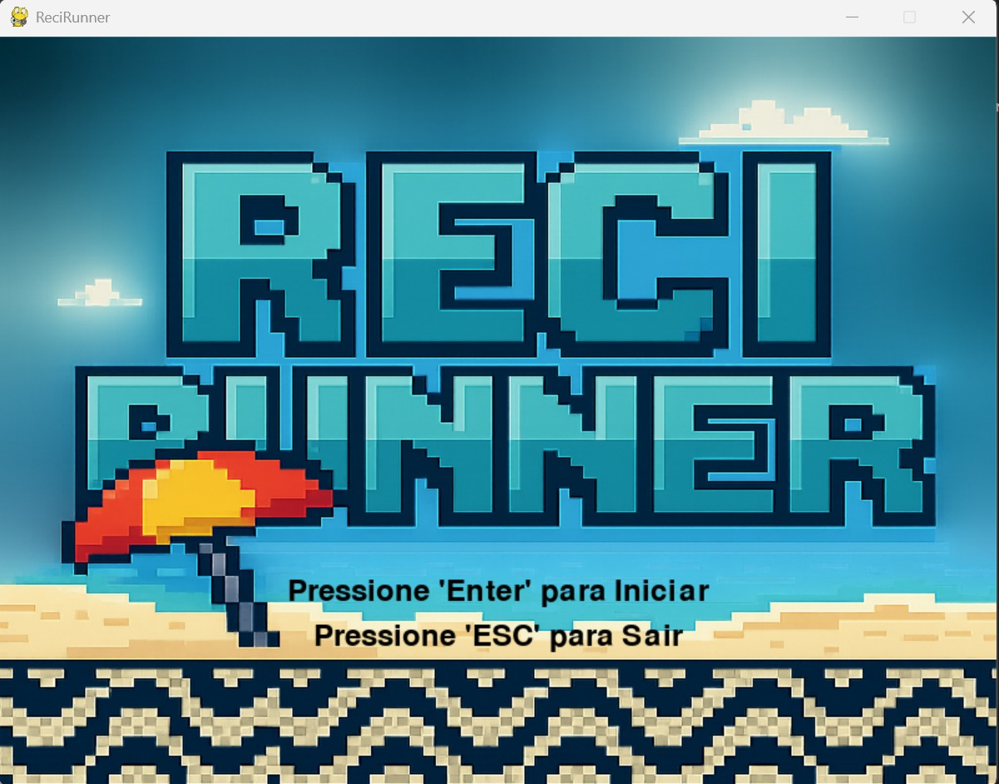
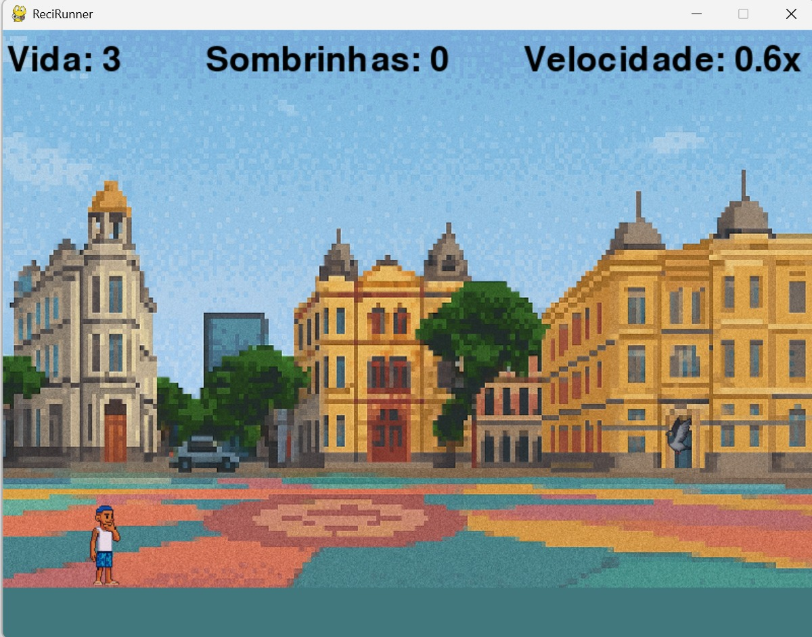
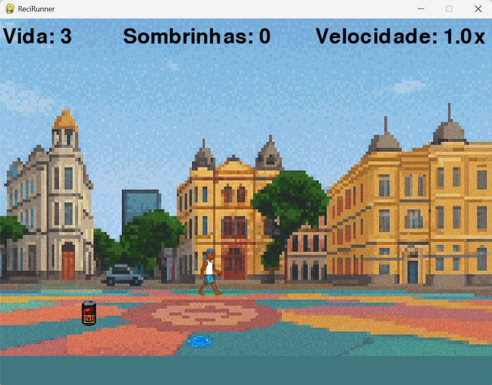
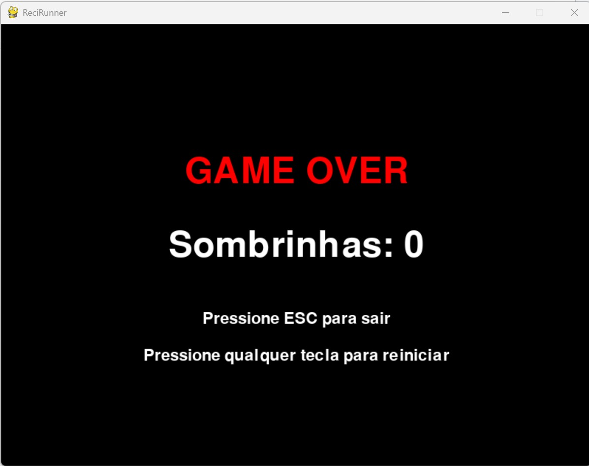

# ReciRunner

Um jogo de corrida infinita com temática pernambucana desenvolvido em Pygame.

## 🧑‍💻 Membros da Equipe

- Luiz Felipe Barros <lfpab>
- Jefferson Pereira <jpoj>
- Leonardo Ibiapina <ljoi>
- Artur Bezerra <abs11>
- Matheus Enrico <mecsb>
- Beatrice Litssa <blqp>

## 🏗️ Arquitetura do Projeto

O projeto foi desenvolvido utilizando a biblioteca Pygame e segue uma estrutura modular para facilitar a manutenção e evolução do código.

- `nomedojogo/`
  - `assets/` → Imagens, sons e fontes utilizadas no jogo
  - `src/` → Código-fonte principal
    - `main.py` → Arquivo principal que inicia o jogo
    - `player.py` → Classe responsável pelo controle do jogador
    - `obstacles.py` → Classe para os obstáculos
    - `collectables.py` → Classe para os coletáveis
    - `config.py` → Configurações globais (resolução, FPS, etc)
    - `level.py` → Classe para criação do mapa principal
  - `docs/` → Documentação e relatórios
  - `README.md`

## Capturas de Tela






## 🛠️ Ferramentas e Tecnologias

- **Pygame**: Biblioteca principal para desenvolvimento do jogo
- **Random**: Utilizado para gerar de forma aleatória os coletáveis, obstáculos e outros objetos do jogo.

## Divisão de Trabalho
- **[Leonardo Ibiapina]**: Implementação do player e movimentação, e criação da base do relatório
- **[Beatrice]**: Desenvolvimento dos obstáculos e lógica de colisão.
- **[Jefferson Pereira]**: Implementação dos itens coletáveis e ajustes de dificuldade.
- **[Artur Bezerra, Luiz Felipe Barros]**: Implementação de interface do jogo (sprites, etc).
- **[Matheus Enrico]**: Slides, apresentação e finalização do relatório.

## Conceitos Aplicados da Disciplina
- **Programação Orientada a Objetos**: Utilizada na organização do código, separando lógicas em classes como Player, Obstacle e Item.
- **Estruturas de Dados**: Listas para armazenar e gerenciar múltiplos obstáculos e itens simultaneamente.
- **Condicionais**: Utilizados para comparar valores dentro do jogo.
- **Laços de repetição**: Usados para gerar automações repetitivas dentro do jogo.

## Desafios e Erros Enfrentados
- Aprender a utilizar a ferramenta pygame
- Aprender e aplicar POO
- Organização do tempo para desenvolvimento
- Versionamento de código 

### Qual foi o maior erro cometido durante o projeto? 
- Começar a criar a lógica do jogo de uma forma muito complexa, para o que era necessário para entrega do projeto
### Como vocês lidaram com ele? 
- Tivemos que apagar toda a parte da lógica e refazer de forma mais simples e eficiente

### Qual foi o maior desafio enfrentado durante o projeto? 
- Sem dúvida a organização do tempo, para desenvolver o projeto e equilibrar com as outras demandas da universidade.
### Como vocês lidaram com ele?
- Nós iniciamos o estudo e o desenvolvimento do projeto, no momento inicial que foi lançado a requisição, fizemos uma pausa durante a semana de avaliações e retornamos após a mesma, para finalizar o que ficou pendente.

### Quais as lições aprendidas durante o projeto?
- Fazer a lógica das atividades de forma simples e bem feita
- Fazer de forma mais organizada o versionamento do código
- Utilizar ferramentas de gerenciamento do grupo, para sabermos o que cada um está desenvolvendo
- Sempre comunicar dificuldades enfrentadas, para que alguém possa ajudar o mais rápido possível
- Ser sincero caso não saiba de algo e precisar de ajuda

## 🎮 Como Executar

1. Clone o repositório:
```bash
git clone https://github.com/ibiapleo/aprendendo-pygame.git
```
2. Instale as dependências:
```bash
pip install pygame
```
3. Navegue até a pasta src:
```bash
cd .\src\
```
4. Rode o jogo:
```bash
python main.py
```